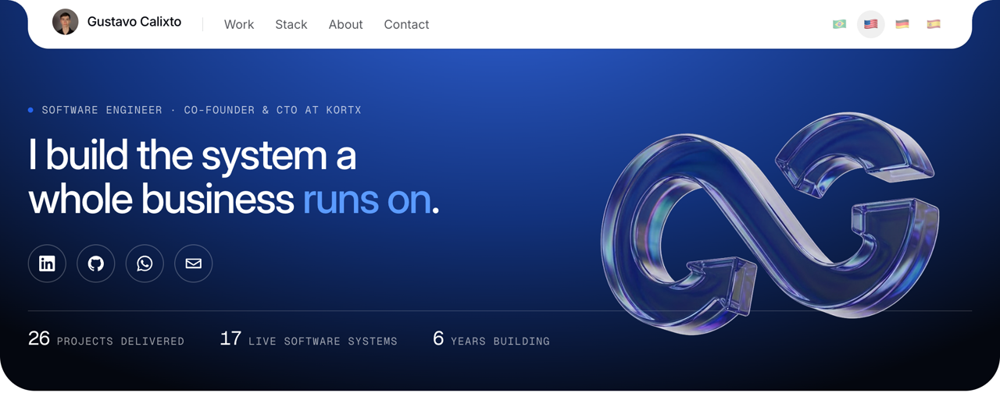
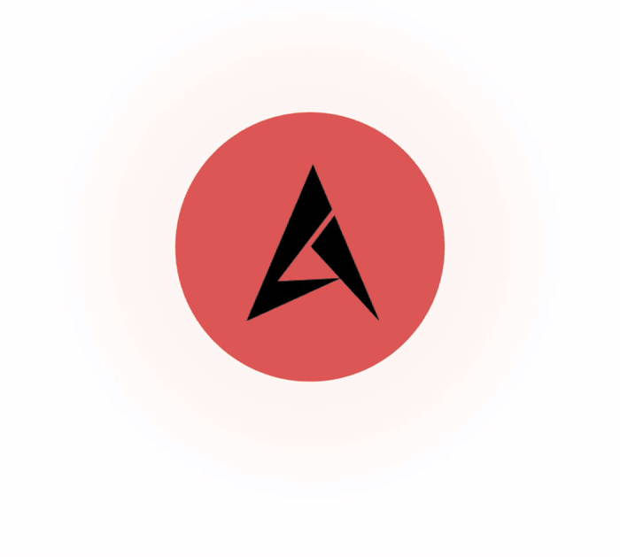
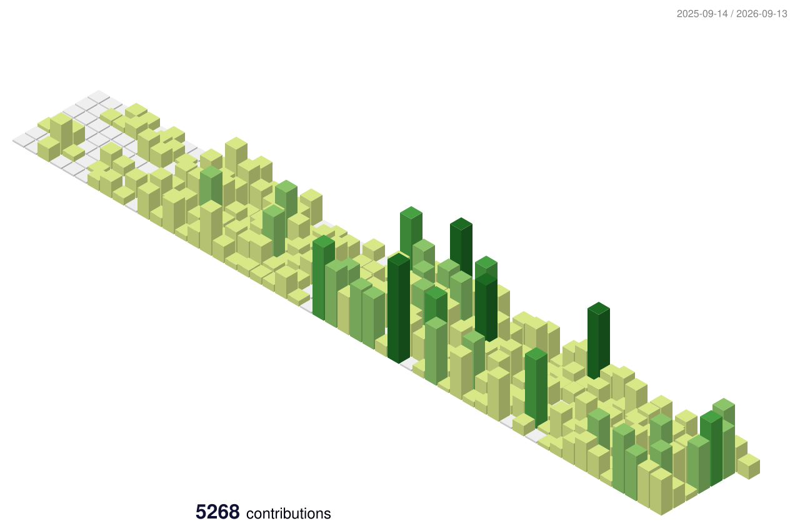

  
  
  
  

<h3 align="center">26 projects delivered &nbsp;·&nbsp; 17 live software systems &nbsp;·&nbsp; 6 years building</h3>

Co-founder and CTO at KortX. I spend my days inside systems real people use to work: ERPs, SaaS, APIs and AI assistants, in production, with paying clients. The database, the rules and the interface get the same attention, and that is what makes a system feel whole.

 

<code>WORK</code>

<h2 align="center">What I build</h2>

  

Almost all of it is client software, closed source. Every project below opens its page on the site, with all modules recorded on video.

| Project | What it is |
|---|---|
| [Alpha Motos](https://www.gustacg.com/en/projects/alpha-motos) | A live ERP for a motorcycle dealership network that sells in instalments: from first contact to last instalment, with workshop, parts, public site, customer portal and an AI chat hub on the same database. The client's recurring revenue grew 83% since go-live. |
| [Safari Broker](https://www.gustacg.com/en/projects/safari-broker) | Multi-tenant SaaS for estate agencies: their own site on their own domain, a CRM with pipelines, a property portfolio on the map, deals, digitally signed contracts, finance and a service hub. R$ 29.7M negotiated on the platform. |
| [Avance](https://www.gustacg.com/en/projects/avance) | Language school ERP with an AI assistant on WhatsApp that sells, looks after the student and calls in a person when needed. Fourteen modules in production. |
| [Riff](https://www.gustacg.com/en/projects/riff) | An API and a panel for checking vehicle fines, road tax and licensing, with scheduled fleet monitoring, batch lookups and automatic monthly billing. R$ 2M in debts surfaced across 6,091 lookups. |
| [Prospecto](https://www.gustacg.com/en/projects/prospecto) | White-label platform for agency management: AI-powered CRM, digital contracts, proposals and finance, fully deployed in Docker. |
| [Ferry Boat SLZ](https://www.gustacg.com/en/projects/ferry-boat-slz) | Mobile MVP for a ferry: ticket and vehicle booking, a digital queue with your position, and boarding checked by QR code. |
| [Crias](https://www.gustacg.com/en/projects/crias) | Mobile app (PWA) for group habits with an RPG feel: daily check-in, streaks, gold, a character moving along a trail and a rewards shop. |

 

<code>ACTIVITY</code>

<h2 align="center">A year of commits, almost all in private repositories</h2>

<picture>
  <source media="(prefers-color-scheme: dark)" srcset="profile-3d-contrib/profile-night-green.svg">
  
</picture>

  <picture>
    <source media="(prefers-color-scheme: dark)" srcset="https://streak-stats.demolab.com/?user=gustacg&theme=dark&hide_border=true">
    
  </picture>

 

<code>STACK</code>

<h2 align="center">Some of the tools I work with</h2>

  <picture>
    <source media="(prefers-color-scheme: dark)" srcset="https://skillicons.dev/icons?i=ts%2Creact%2Cnextjs%2Ctailwind%2Cnodejs%2Cdeno%2Cpython%2Cfastapi%2Cpostgres%2Csupabase%2Credis%2Crabbitmq&theme=dark&perline=12">
    
  </picture>
   
  <picture>
    <source media="(prefers-color-scheme: dark)" srcset="https://skillicons.dev/icons?i=docker%2Cnginx%2Caws%2Cvercel%2Cgit%2Cgithubactions%2Csentry%2Cfigma%2Cphotoshop%2Cillustrator%2Cae%2Cwordpress&theme=dark&perline=12">
    
  </picture>

Plus n8n, Docker Swarm, Traefik, Portainer, MinIO, Meta Tech Provider, Chatwoot, React Native, Expo, PWA, push notifications, RAG and embeddings.

 

  
  &nbsp;
  

